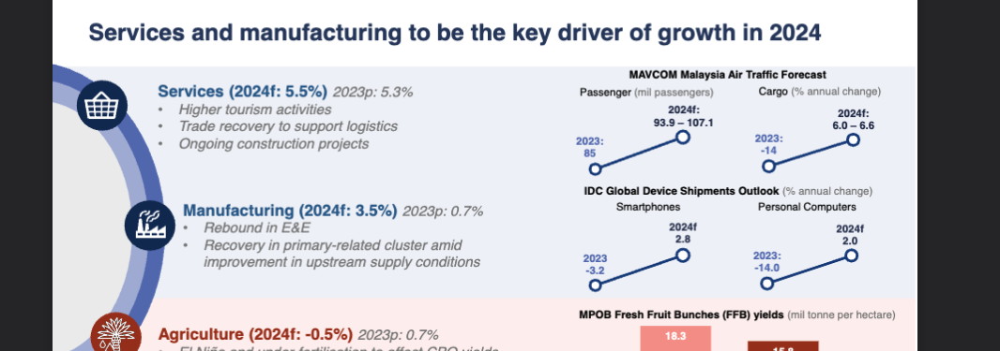

# Building RAG with Unstructured Data

A complete implementation of Retrieval-Augmented Generation (RAG) system for processing unstructured documents, based on the [HuggingFace RAG with Unstructured Data Cookbook](https://huggingface.co/learn/cookbook/en/rag_with_unstructured_data).

## Overview

This project demonstrates how to build an end-to-end RAG system that can process various document formats (PDFs, images, presentations) and answer questions based on their content. The system uses Unstructured.io for document parsing, LangChain for orchestration, ChromaDB for vector storage, and OpenAI for embeddings and language modeling.

## Architecture

```
Raw Documents → Preprocessing → Chunking → Vector Store → RAG System
     ↓              ↓             ↓           ↓            ↓
  PDF/Images → JSON Elements → Chunks → ChromaDB → Q&A Interface
```

## Features

- **Multi-format Support**: Process PDFs, images, and other document types
- **Smart Chunking**: Uses Unstructured's title-based chunking for better context preservation
- **Vector Search**: ChromaDB for efficient similarity search
- **OpenAI Integration**: GPT-3.5-turbo for answers, text-embedding-3-small for embeddings
- **Source Attribution**: Tracks and displays source documents for answers
- **Interactive Interface**: Command-line Q&A system

## Setup

### Prerequisites

```bash
pip install unstructured-client langchain-community langchain-openai chromadb
```

### Environment Variables

Create a `.env` file:

```bash
OPENAI_API_KEY=your_openai_api_key_here
```

### Directory Structure

```
BuildingRAGwithUnstructuredData/
├── FileFolder/          # Input documents (PDFs, images, etc.)
├── output/             # Processed JSON elements from Unstructured
├── chunked_output/     # Chunked documents ready for RAG
├── chroma_db/         # ChromaDB vector database
├── preprocessing.py    # Document processing with Unstructured API
├── chunking.py        # Smart chunking of processed elements
├── setupLangchain.py  # Convert chunks to LangChain documents
├── setupRAG.py        # Complete RAG system setup
└── README.md          # This file
```

## Usage Workflow

### 1. Document Preprocessing (`preprocessing.py`)

Processes raw documents using Unstructured.io API with GPT-4o vision model:

```bash
python preprocessing.py
```

**Features:**
- Automatic format detection
- GPT-4o vision for complex documents
- Parallel processing with async/await
- Outputs structured JSON elements

**Configuration:**
- Strategy: AUTO (intelligent document parsing)
- VLM Model: GPT-4o for visual understanding
- PDF splitting enabled with high concurrency

### 2. Smart Chunking (`chunking.py`)

Chunks processed elements using title-based strategy for better context:

```bash
python chunking.py
```

**Features:**
- Title-based chunking preserves document structure
- Configurable chunk sizes (default: 1000 chars max)
- Overlap handling for continuity
- Metadata preservation and enhancement

**Configuration:**
- `max_characters`: 1000 (maximum chunk size)
- `new_after_n_chars`: 800 (preferred chunk size)
- `combine_text_under_n_chars`: 200 (combine small sections)
- `overlap`: 50 (overlap between chunks)

### 3. LangChain Integration (`setupLangchain.py`)

Converts chunked elements to LangChain Document format:

```bash
python setupLangchain.py
```

**Features:**
- Metadata filtering for ChromaDB compatibility
- Source tracking for attribution
- Document format standardization

### 4. RAG System Setup (`setupRAG.py`)

Creates the complete RAG system with vector store (one-time setup):

```bash
python setupRAG.py
```

**Features:**
- ChromaDB vector store with persistence
- OpenAI embeddings (text-embedding-3-small)
- GPT-3.5-turbo configuration
- Vector database creation and storage

### 5. Interactive Querying (`query.py`)

Fast querying interface that loads the existing RAG system:

```bash
python query.py
```

**Features:**
- Loads existing ChromaDB (no rebuilding)
- Interactive Q&A interface
- Source document attribution
- Much faster startup time

## System Components

### Document Processing Pipeline

1. **Unstructured API Processing**:
   - Handles multiple formats (PDF, images, Word, PowerPoint)
   - Uses GPT-4o vision model for complex visual content
   - Extracts structured elements (titles, text, tables, lists)

2. **Smart Chunking**:
   - Preserves document structure using title-based strategy
   - Maintains context across page boundaries
   - Optimizes chunk sizes for better retrieval

3. **Vector Storage**:
   - ChromaDB for efficient similarity search
   - Persistent storage for reuse
   - Metadata filtering for compatibility

4. **RAG Chain**:
   - Retrieval: Top-3 similarity search
   - Generation: GPT-3.5-turbo with custom prompt
   - Source attribution for transparency

### Configuration Details

**Chunking Strategy:**
- Uses `chunk_by_title` for structure-aware chunking
- Preserves cross-page sections
- Optimized for financial/government documents

**Vector Store:**
- ChromaDB with local persistence
- OpenAI text-embedding-3-small (cost-effective)
- Similarity search with k=3 retrieval

**Language Model:**
- GPT-3.5-turbo (cost-effective)
- Temperature: 0.2 (factual responses)
- Max tokens: 200 (concise answers)

## Example Usage

Once the system is set up, you can ask questions about your documents:

```
Your question: Tell me about services and manufacturing in 2024.

Answer: In 2024, services and manufacturing are expected to be the key drivers of growth. The Malaysian Aviation Commission forecasts a 5.5% growth in services, with higher tourism activities and trade recovery supporting logistics. Manufacturing is forecasted to grow by 3.5%, driven by a rebound in Electronics and Electrical (E&E) sector and recovery in primary-related clusters. Agriculture, however, is expected to decline by 0.5% due to factors like El Niño and under-fertilization affecting CPO yields.

Sources:
1. ar2023_slides.pdf.json: Services and manufacturing to be the key driver of growth in 2024
2. ar2023_slides.pdf.json: Note: The 2024 growth forecasts are annual growth forecasts for services, manufacturing and agriculture...
3. ar2023_slides.pdf.json: Weaker external demand and global technology downcycle weighed on production and exports
```

**System Verification:**



Additional test confirms the RAG system is working properly with accurate source attribution.

## Performance & Cost Optimization

- **Embeddings**: text-embedding-3-small (more cost-effective than ada-002)
- **LLM**: GPT-3.5-turbo (balanced cost/performance)
- **Chunking**: Optimized sizes to balance context and retrieval accuracy
- **Caching**: ChromaDB persistence reduces reprocessing costs

## Troubleshooting

### Common Issues

1. **No documents found**: Run `chunking.py` first to create chunked documents
2. **OpenAI API Key**: Ensure `OPENAI_API_KEY` is set in environment or `.env` file
3. **Empty responses**: Check if documents were properly processed and chunked
4. **ChromaDB errors**: Ensure metadata doesn't contain complex nested objects

### File Dependencies

Ensure files exist in correct directories:
- Raw documents: `./FileFolder/`
- Processed JSON: `./output/`
- Chunked documents: `./chunked_output/`

## References

- [HuggingFace RAG with Unstructured Data Cookbook](https://huggingface.co/learn/cookbook/en/rag_with_unstructured_data)
- [Unstructured.io Documentation](https://docs.unstructured.io/)
- [LangChain Documentation](https://python.langchain.com/)
- [ChromaDB Documentation](https://docs.trychroma.com/)

## License

This project is based on the HuggingFace cookbook and is intended for educational purposes.